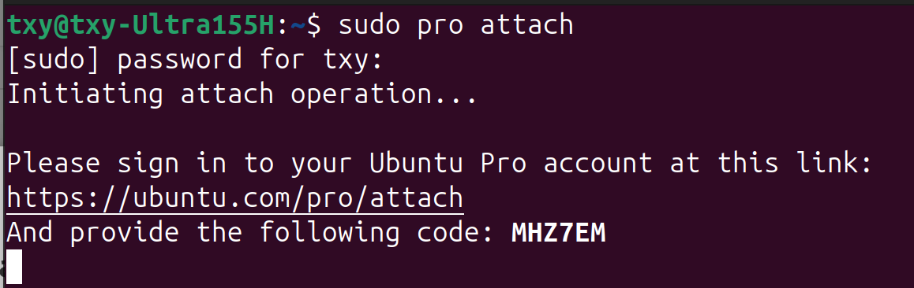
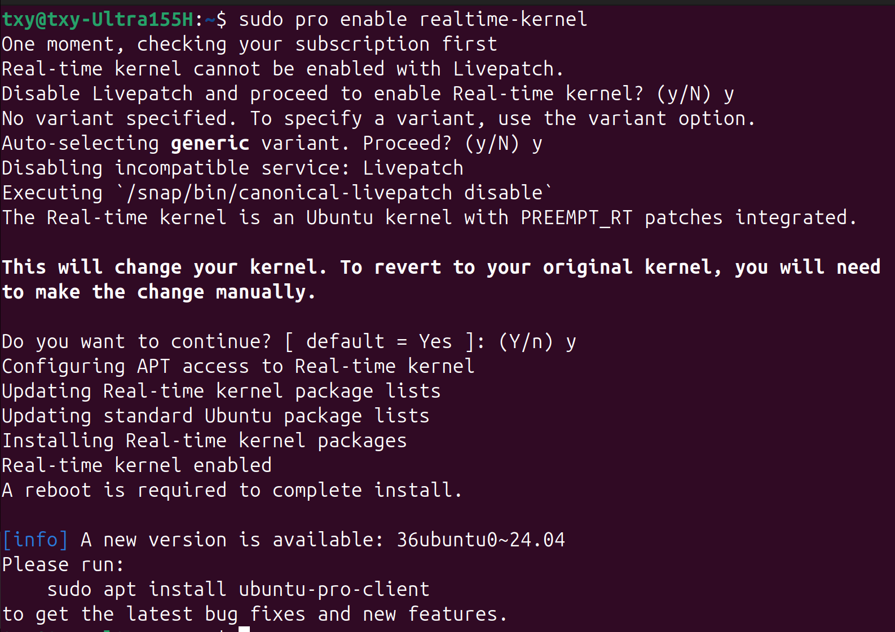
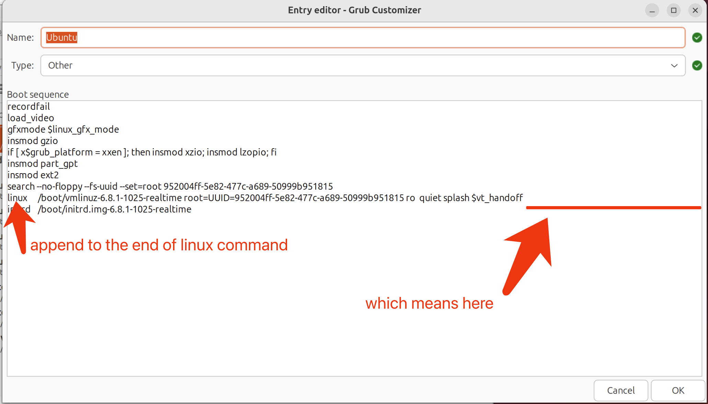
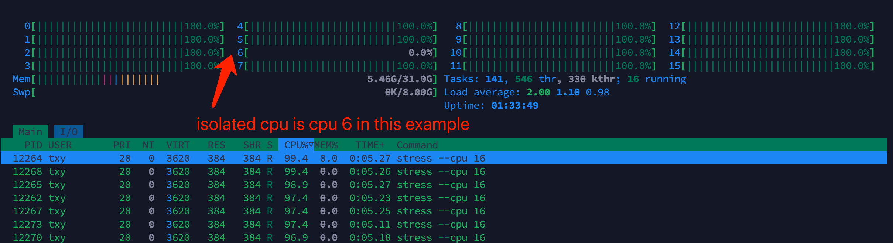

## Environment Setup Tutorial

> Refered from [AIMEtherCAT/EcatV2_Master/docs/environment-setup.md](https://github.com/AIMEtherCAT/EcatV2_Master/blob/main/docs/environment-setup.md)

### BIOS Setup

Since BIOS layouts vary by manufacturer, the configuration items listed below may have different names or be missing on your machine. If you cannot find specific items, feel free to skip them.

* **Disable** Race To Halt (RTH)
* ~~**Disable** Hyper-Threading~~ (Updated: If you system resources is limited, you may don't want to lose half of your
  threads. In this case you can ignore this item.)
* **Disable** Virtualization Support
* **Disable** C-State Support
* If your system can **lock the CPU frequency**, **disable** TurboBoost/SpeedStep/SpeedShift, and set the CPU frequency to a fixed value

### System Setup

**Ubuntu 24.04** with **ROS2 Jazzy** is recommended for this application.

**Ubuntu 22.04** with **ROS2 Humble** seems also working well.

#### Register Ubuntu One Account

Go to https://login.ubuntu.com/ and register for an account.

#### Attach and enable Ubuntu Pro

When you finish the system installation, enable the **Ubuntu Pro**. It can be enabled in the pop-up window when entering the system for the first time after installation. If you missed this window, you can also use the command ``sudo pro attach`` in the terminal to enable it.

#### Enable Realtime-Kernel

After attaching to the Ubuntu Pro, open the terminal.

~~If you are using Intel **12th** Gen CPU, use the command ``sudo pro enable realtime-kernel --variant=intel-iotg`` in the terminal to enable the realtime-kernel patch, which is specially optimised for this generation of CPU.~~ (update: no very impressive difference identified, just choose whatever you like)

If not, use the command ``sudo pro enable realtime-kernel`` to enable the generic realtime-kernel patch.

When it finishes, restart your computer.

#### Isolate a CPU core

Select one core that you want to use to run the SOEM independently.

For CPUs without a distinction between performance and efficiency cores, you can directly select CPU0.

For Hybrid Architecture CPUs (with both performance and efficiency cores), it's recommended to use the efficiency cores if their base frequency exceeds 2 GHz; otherwise, the performance cores are preferred.

> **Note1.** For CPUs **with hyper-threading function enabled**, you should isolate **entire** physical cores. This
> means, for example, if your CPU has 2 cores and 4 threads, then **CPU0 & CPU1 belong to core 0**, and CPU2 & CPU3 belong
> to core 1. Since a full core needs to be isolated, you must at least isolate **CPU0 and CPU1** in this case. You can
> then choose **first one** of them **for later use** as needed.

> **Note2.** Please note that CPU numbering **starts from 0**, and typically the performance cores come first, followed by the efficiency cores.

After selecting a core number (Let's refer to it as **X**), we can know the ID of other core numbers (Let's refer to it
as **Y**).

Then edit the grub boot commands by appending this content to the end of the **linux** command: ``nohz=on nohz_full=X rcu_nocbs=X isolcpus=X irqaffinity=Y``

For example, if we have an 8-core CPU, and we select CPU0 to isolate, then X=0 and Y=1,2,3,4,5,6,7, and the final
content to be appended will be ``nohz=on nohz_full=0 rcu_nocbs=0 isolcpus=0 irqaffinity=1,2,3,4,5,6,7``

This step can be easily done by using the **grub-customizer** application, which is a grub configuration editor. Please search for the installation manual yourself.

After finishing, reboot your computer.

If you want to confirm whether the configuration was successful, you can use the **htop** monitor. If the CPU usage of
the selected CPU in htop can continuously stay at 0% or 1%, it indicates that the configuration succeeded.

You can also use the command `cat /proc/cmdline` to check if the GRUB boot parameters are saved.

If any errors occur, please read the manual and try again.

>[!Warn]
> If you've SOEM installed or by any chance you had already configured CPU cores (Refer to the command `cat /proc/cmdline`), make sure that you directly edit the existing GRUB boot commands instead of appending a new one, otherwise the system may not boot properly due to conflicting parameters. If you find multiple `nohz`, `nohz_full`, `rcu_nocbs`, `isolcpus`, or `irqaffinity` parameters, please keep only one set of them and remove the others.
> 
> The settings in this package will not override GRUB configs, instead, they will be applied on top of the existing GRUB configs. So if you have already configured CPU isolation in GRUB, you can just keep it and apply the settings in this package without worrying about conflicts. The settings in this package will work together with your existing GRUB configs to achieve the desired CPU isolation effect.
> 
> Still Note that SOEM requires a **clean isolation** of the selected CPU core, which means that the selected CPU core should not be used by any other processes or threads. If there are conflicting GRUB parameters that cause the selected CPU core to be used by other processes or threads, it may lead to unexpected behavior and performance issues. Therefore, it's important to ensure that the GRUB boot commands are correctly configured to achieve a clean isolation of the selected CPU core for SOEM.